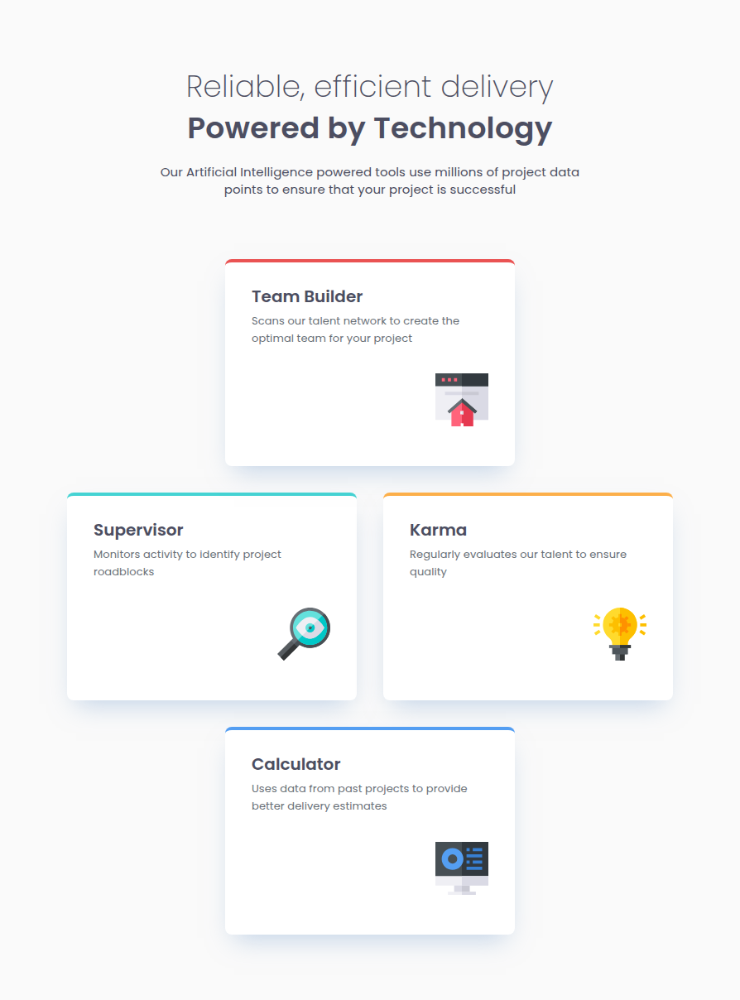

# Frontend Mentor - Four card feature section solution

This is a solution to the [Four card feature section on Frontend Mentor](https://www.frontendmentor.io/challenges/four-card-feature-section-weK1eFYK).
Frontend Mentor challenges help improve frontend skills by building realistic UI components.

## Table of contents

- [Overview](#overview)
  - [Preview](#screenshot)
  - [Links](#links)
- [Features](#features)
- [My process](#my-process)
  - [Built with](#built-with)
  - [What I learned](#what-i-learned)
- [Setup](#setup)
  - [Installation](#installation)
  - [Development](#development)
  - [Build](#build)
  - [Linting](#linting)
- [Deployment](#deployment)
- [Performance](#performance)
- [Continued Development](#continued-development)
- [Useful Resources](#useful-resources)
- [AI Collaboration](#ai-collaboration)
- [Author](#author)
- [Notes](#notes)

## Overview

### The challenge

Users should be able to:

- View the optimal layout for the site depending on their device's screen size

### Preview

<details>
  <summary>Click to expand website preview</summary>
  <br>
  <p align="center">
    
  </p>
</details>

### Links

- Solution URL: [GitHub Repo](https://github.com/vlrnsnk/four-card-feature-section)
- Live Site URL: [Live Site](https://vlrnsnk.github.io/four-card-feature-section)

## Features

- **Responsive Mobile-First Layout:** Fluid transitions tracking seamlessly from narrow mobile up to ultra-wide 1440px+ displays.
- **Advanced Asymmetric CSS Grid:** A carefully engineered layout utilizing dynamic track sizing to create a balanced layout across tablet and desktop viewpoints.
- **Accessible Structural Elements:** Leverages semantic HTML (`<ul>` lists containing self-contained `<article>` elements) to optimize assistive technology mapping.
- **Hidden Decorative Assets:** Dual-layered screen reader optimization using empty `alt` attributes alongside explicit `aria-hidden="true"` declarations.
- **Modular SCSS Architecture:** Scalable structural separation using `@use` rules to divide layout configurations from decoupled component styles.
- **CSS Custom Properties:** Design tokens mapping system variables directly to typography weights, layout spacing, and Figma colors.
- **Pixel-Perfect Figma Translations:** Flawless replication of complex shadow vectors, including negative spread properties (`-11px`).
- **Stylelint Configuration:** Automated quality assurance checking property ordering and nesting limits.
- **Optimized Production Build:** Lightning-fast deployment bundle optimization powered by Vite.
- **Automated CI/CD Pipeline:** Automated deployment workflows pushing to GitHub Pages via GitHub Actions.

## My process

### Built with

- Semantic HTML5 markup (Lists, Headers, Articles, Sections)
- Advanced CSS Grid & Flexbox
- SCSS (Structured workspace: `abstracts/`, `base/`, `components/`, `layout/`)
- Mobile-first responsive development lifecycle
- Modern CSS HSL color spaces with alpha channel syntax
- Vite bundling framework
- Stylelint (Enforcing clean, standardized style sheets)
- Husky (Pre-commit Git hooks ensuring code cleanliness before pushing)

### What I learned

- {{LEARNING_1}}
- {{LEARNING_2}}
- {{LEARNING_3}}

## Setup

### Installation

```bash
npm install
```

### Development

```bash
npm run dev
```

### Build

```bash
npm run build
npm run preview
```

### Linting

```bash
npm run lint:scss
npm run lint:html
```

This project uses Stylelint + EditorConfig + Husky pre-commit hooks
to ensure consistent code formatting before commits.

### Fix linting issues:

```bash
npm run lint:scss:fix
npm run lint:html:fix
```

## Deployment

Project is built with Vite and deployed to GitHub Pages using GitHub Actions.

## Performance

Lighthouse score (example):

- Performance: 100
- Accessibility: 100
- Best Practices: 100
- SEO: 100

## Continued Development

- **Fluid Typography Engine**: In upcoming projects, I intend to transition away from static media query font scaling and implement dynamic typography engines driven by CSS clamp() properties.
- **Subgrid Implementations**: I want to further explore grid-template-rows: subgrid to cleanly align inner card elements (like matching heading baselines) across separate parent columns without forcing rigid container heights.

## Useful Resources

- [MDN Web Docs - CSS Grid Layout](https://developer.mozilla.org/en-US/docs/Web/CSS/CSS_Grid_Layout) - This remains the definitive guide for understanding track configurations, row explicit placements, and debugging unexpected sizing behaviors.
- [BEM Methodology Guide](https://www.google.com/search?q=https://en.bem.info/methodology/) - Crucial documentation that helped me understand component isolation rules, preventing grandchild nesting anti-patterns.

## AI Collaboration

I used **Gemini** as an expert front-end pair programmer and code reviewer throughout this project.

- **Architecture Auditing:** The AI helped evaluate my markup iterations, transforming standard structural tags into highly accessible elements (`ul` layout wrappers paired with independent `article` components).
- **Asymmetric Grid Debugging:** When my grid-template-areas caused the top and bottom cards to stretch incorrectly across multiple tracks, the assistant isolated the rendering flaw, explained how the browser calculates spanning tracks, and helped rewrite the constraints using isolated item placements.
- **Refining Tokens:** The assistant simplified hex conversion pipelines, providing modern, comma-free HSL code blocks (`hsl(hue sat light / alpha)`) for my design tokens.

## Author

- Website: https://vlrnsnk.com
- Frontend Mentor: https://www.frontendmentor.io/profile/vlrnsnk
- GitHub: https://github.com/vlrnsnk

## Notes

- Accessibility-focused semantic markup ensures screen-readers navigate layout contexts seamlessly.
- Mobile-first responsive workflow eliminates structural layout breaking across target endpoints.
- Modular SCSS architecture using `@use` isolates global abstractions from structural elements.
- Consistent styling enforced with Stylelint prevents property duplication and architectural regressions.
- Optimized Vite build pipeline guarantees exceptional page performance metrics.
- GitHub Pages deployment managed automatically through secure GitHub Actions workflows.
